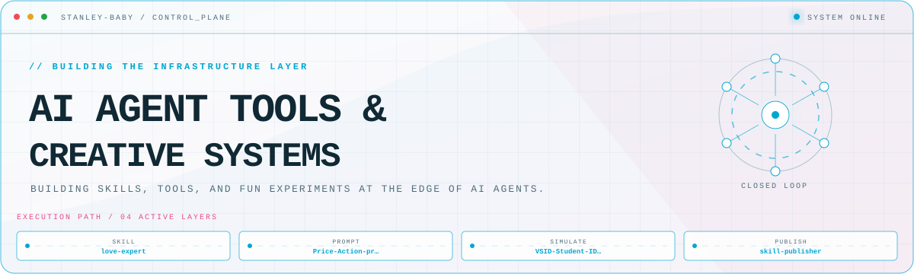
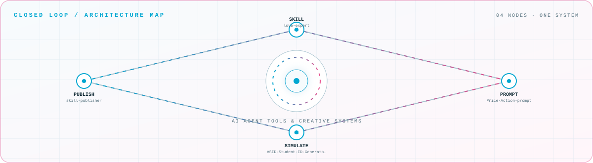

<picture>
  <source media="(prefers-color-scheme: dark)" srcset="assets/hero-dark.svg">
  <source media="(prefers-color-scheme: light)" srcset="assets/hero-light.svg">
  
</picture>

 

Building skills, tools, and fun experiments at the edge of AI agents\.

## Flagship systems

| Repository | Role | Purpose |
| --- | --- | --- |
| [`love-expert`](https://github.com/Stanley-baby/love-expert)  | SKILL | AI agent skill for dating advice and relationship coaching |
| [`Price-Action-prompt`](https://github.com/Stanley-baby/Price-Action-prompt)  | PROMPT | Price action prompts for AI translation workflows |
| [`VSID-Student-ID-Generator-pro`](https://github.com/Stanley-baby/VSID-Student-ID-Generator-pro)  | SIMULATE | Cyberpunk student ID generator with simulation |
| [`skill-publisher`](https://github.com/Stanley-baby/skill-publisher)  | PUBLISH | One-click publish Claude Code skills to GitHub |

## Closed-loop architecture

<picture>
  <source media="(prefers-color-scheme: dark)" srcset="assets/closed-loop-dark.svg">
  <source media="(prefers-color-scheme: light)" srcset="assets/closed-loop-light.svg">
  
</picture>

## Module registry

<strong>AI Agent Tools</strong> · 3 modules

| Module | Purpose |
| --- | --- |
| [`love-expert`](https://github.com/Stanley-baby/love-expert) | AI agent skill for dating advice and relationship coaching |
| [`skill-publisher`](https://github.com/Stanley-baby/skill-publisher) | One-click publish Claude Code skills to GitHub |
| [`Price-Action-prompt`](https://github.com/Stanley-baby/Price-Action-prompt) | Price action prompts for AI translation workflows |

<strong>Creative Projects</strong> · 3 modules

| Module | Purpose |
| --- | --- |
| [`VSID-Student-ID-Generator-pro`](https://github.com/Stanley-baby/VSID-Student-ID-Generator-pro) | Cyberpunk student ID generator with simulation |
| [`IPTV`](https://github.com/Stanley-baby/IPTV) | Self-hosted IPTV live stream sources |
| [`giffgaff-to-qr`](https://github.com/Stanley-baby/giffgaff-to-qr) | Cloudflare-based giffgaff eSIM QR generator |

<strong>Developer Tools</strong> · 3 modules

| Module | Purpose |
| --- | --- |
| [`Speedtest-CF`](https://github.com/Stanley-baby/Speedtest-CF) | Cloudflare Workers based speed test service |
| [`Delete-CF-A-records-in-batches`](https://github.com/Stanley-baby/Delete-CF-A-records-in-batches) | Batch deletion of A records in CloudFlare |
| [`Multi-Time-Cycle-EMA-Indicators`](https://github.com/Stanley-baby/Multi-Time-Cycle-EMA-Indicators) | Multi-time cycle EMA technical indicators |

<a href="https://github.com/Stanley-baby">GitHub</a>

<!-- Generated by profile-control-plane. Edit profile.yaml, not this file. -->
